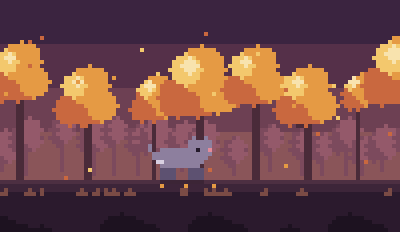
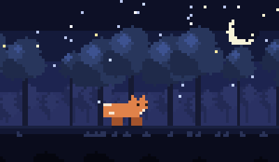
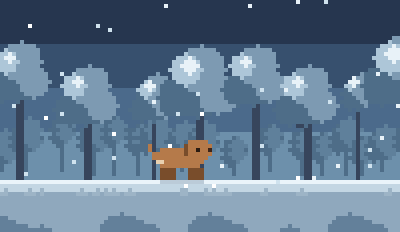

# Pixel Pets

A pixel-art pet that lives in a panel in your Explorer sidebar. Throw it a ball and it
runs after it. Click it and it gets hearts. Leave it alone for a minute and it falls
asleep. Good company while a build, a test suite, or an agent is running.



Nothing ships as an image. The entire scene — sky, two rows of trees, ground, weather,
and the animal — is drawn with `fillRect` onto a ~100×58 canvas that's scaled up with
`image-rendering: pixelated`. The whole extension is three files of dependency-free
JavaScript.

## Features

- **A pet in the Explorer.** It wanders, sits, and sleeps on its own schedule.
- **Fetch.** Click anywhere in the scene and a ball drops there, bounces, and the pet
  chases it down.
- **Pet it.** Click the animal itself for hearts.
- **Four pets** — cat, dog, fox, and a ghost that floats instead of walking.
- **Three scenes**, switched from the panel's title bar or settings.
- **Rock paper scissors** on `Ctrl+Alt+R`, in a quick pick that floats over the editor,
  terminal, or settings. Win a round and the pet gets a ball thrown for it.

| Night | Snow |
| --- | --- |
|  |  |

## Commands

All under **Pixel Pets** in the Command Palette, and in the panel's title bar:

| Command | What it does |
| --- | --- |
| `Pixel Pets: Throw Ball` | Drops a ball for the pet to fetch |
| `Pixel Pets: Choose Pet` | Cat, dog, fox, or ghost |
| `Pixel Pets: Next Scene` | Cycles forest → night → snow |
| `Pixel Pets: Play Rock Paper Scissors` | `Ctrl+Alt+R` (`Cmd+Alt+R` on macOS) |
| `Pixel Pets: Reset Score` | Clears the win/loss record |

## Settings

| Setting | Default | What it does |
| --- | --- | --- |
| `pets.species` | `cat` | Which animal lives in the Explorer. |
| `pets.theme` | `forest` | `forest`, `night`, or `snow`. |
| `pets.showStatusBar` | `true` | Rock-paper-scissors score in the status bar. |

## How it's drawn

`petView.js` is a `WebviewViewProvider` contributed to the `explorer` view container, with
`retainContextWhenHidden` so the pet keeps its position when the panel is collapsed.

- The **background** is drawn once into an offscreen canvas and blitted each frame. Trees
  come from a seeded PRNG, so the forest is stable across redraws but different in shape
  everywhere: a packed back row in flat silhouette, an irregularly spaced front row with
  lit canopies, and cropped foreground bushes along the bottom. Spacing is randomised
  rather than stepped — evenly spaced trunks read as a fence, not a forest.
- **The pet** is an 8-row character matrix per species (`x` fur, `d` shade, `l` belly,
  `e` eye, `n` nose) mapped through a palette, with legs, tail, and squash drawn
  procedurally, so a walk cycle, a sit, a sleep, and a happy bounce all come off one
  sprite. Facing left is `scale(-1, 1)`.
- **Everything is `fillRect`** — no arcs, no gradients, no antialiasing — which is what
  keeps pixels crisp when the canvas is scaled up. The marketplace icon is composed from
  the same sprite data, so it can't drift from what you see in the sidebar.

The animation loop runs on `requestAnimationFrame` and only while the panel is visible;
VS Code suspends the webview otherwise.

## Building and publishing

No build step — plain JS, no dependencies, nothing to compile.

```sh
npm install -g @vscode/vsce
vsce package                       # -> pixel-pets-0.2.0.vsix
code --install-extension pixel-pets-0.2.0.vsix
```

To publish, set `publisher` in `package.json` to your Marketplace publisher ID, point
`repository` at your GitHub repo, then:

```sh
vsce login <your-publisher-id>
vsce publish
```

## License

MIT
